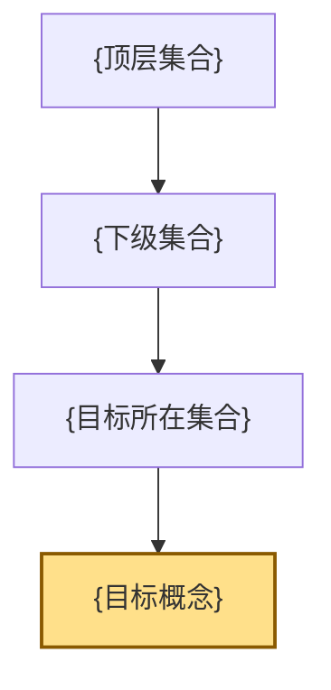

# shy-knowledge_topology

## 目标

把一个孤立概念、模糊困惑或当前表达方式，变成一棵可学习、可扩展、可保存的知识树。

本 skill 有两个必答模块：

1. **概念拓扑模块**：向上追溯归属、横向补全同级概念。
2. **盲区发现模块**：从当前表达方式反推出可能遗漏的同级概念、维度缺口和最小验证路径。该模块每次都必须回答，且必须保持领域中立，不能默认套用量化、编程、商业等特定领域框架。

核心问题链：

1. 这个概念是什么语境下的概念？
2. 它和哪些概念并列？
3. 它们共同归属于哪个集合？
4. 这个集合和哪些集合并列？
5. 它们共同归属于哪个更高层集合？
6. 如此递归，直到到达一个合理的领域顶层。

盲区发现模块的源方法：

1. **现象抽象**：把用户的困惑从具体场景中抽象成“对象、关系、变化、目标、约束、评价”的组合。
2. **当前表达识别**：判断用户当前使用的是哪一种表达方式、分类方式、推理方式或问题框架。
3. **上级集合定位**：找到当前表达方式所属的最小稳定集合。
4. **同级空间展开**：列出同属该集合但用户没有使用的其他表达方式。
5. **维度缺口检测**：判断当前表达方式覆盖了哪些维度、遗漏了哪些维度。
6. **反例压力测试**：问“在什么情况下当前表达会失败”，用失败情境反推可能缺失概念。
7. **优先级排序**：按对当前问题的解释力和验证成本排列候选盲区。
8. **最小验证**：为每个高优先级盲区设计一个最小验证动作。

## 触发判断

高置信触发：

- 用户要求“从一个知识点反推整个领域”
- 用户要求“拓扑知识树”“知识架构图”“树状图”“概念地图”
- 用户询问“和 X 并列的概念有哪些，它们归属于哪个集合”
- 用户要求“递归往上挖”“一直挖到顶层”
- 用户要求把结构“保存成 md / Markdown / 文件 / 图”

中置信触发：

- 用户正在学一个新领域，想建立知识框架
- 用户对某个术语的所在位置感到迷糊
- 用户有多个零散概念，想知道它们之间的包含关系
- 用户说“我不知道这个东西叫什么”
- 用户描述一个失败、困惑或卡点，希望找出自己可能缺失的概念
- 用户问“除了我现在这种做法，还有哪些同层级方法/变量/视角”

不要触发：

- 用户只是问“X 是什么意思”
- 用户只要公式、定义、例子或翻译
- 用户问的是事实性列表，不需要层级结构

## 工作流程

### 0. 选择模式

先判断用户输入的清晰度，但不要跳过盲区发现：

- **概念明确**：先做概念拓扑，再做盲区发现，重点补目标概念的同级缺口。
- **概念不明确**：先做盲区发现，帮助命名当前表达方式，再做概念拓扑。

无论哪种情况，最终输出都必须包含“当前表达方式审计 / 源维度审计 / 可能缺失的同级概念 / 最小验证”。

### 1. 锁定语境

先判断概念是否有多重语境。比如 `theta` 可能是期权希腊值，也可能是算法复杂度符号，也可能是数学角度符号。

如果语境不明确：

- 优先根据对话上下文推断。
- 如果风险较高，先问一个简短澄清问题。
- 如果可以继续，明确写出“我先按某某语境处理”。

盲区发现模块中，语境可以是一个任务域，而不是一个概念名。比如：

- “用变量预测交易结果”属于建模语境。
- “不知道自己缺什么知识”属于元认知与知识组织语境。
- “只有当前点变量，没想到路径变量”属于表征审计语境。

### 1A. 必答：当前表达方式审计

从用户描述中抽取当前已知表达方式，输出：

- 当前做法：用户现在实际在用什么思路、变量、模型或语言。
- 隐含假设：这个做法默认世界是什么样的。
- 表达类型：它属于哪种更一般的表达方式。
- 没表达的东西：它天然遗漏哪些维度。

使用领域中立的源维度审计，不要默认套用具体行业维度：

```text
对象：当前表达关注的是单个对象、多个对象、关系、过程，还是系统？
边界：当前表达把什么纳入问题，把什么排除在外？
尺度：当前表达处在微观、中观、宏观，还是跨尺度？
时间：当前表达是静态、变化、过程、周期，还是生命周期？
关系：当前表达关注属性、结构、因果、反馈，还是约束？
生成：当前表达只描述结果，还是解释结果如何生成？
观察：当前表达处理的是可见量、不可见量、噪声、误差，还是代理指标？
评价：当前表达用什么判断好坏，是否遗漏成本、风险、价值或目标函数？
行动：当前表达只是理解，还是涉及选择、干预、控制、执行？
元层级：当前表达是在谈事实、概念、模型、方法、系统，还是学习路径？
```

这些源维度用于发现“同层级缺失概念”，不是用于生造术语。只有在锁定具体领域后，才允许生成领域化审计维度。

### 1A-2. 必答：抽象算子

当用户不知道术语时，用以下抽象算子生成候选概念空间：

```text
点 → 关系 → 结构 → 系统
静态 → 变化 → 过程 → 演化
属性 → 机制 → 因果 → 反事实
显性 → 隐性 → 潜变量 → 代理变量
局部 → 全局 → 多尺度 → 层级
描述 → 预测 → 解释 → 决策 → 控制
结果 → 路径 → 生成过程 → 反馈循环
单一标准 → 多目标 → 约束优化 → 权衡
```

这些不是固定答案，而是用来逼出“用户当前表达的相邻未探索空间”。

### 1B. 必答：相邻概念矩阵

对当前表达方式建立横向矩阵：

```text
当前表达方式
├─ 同级方式 A：用户已使用
├─ 同级方式 B：可能缺失
├─ 同级方式 C：可能缺失
└─ 同级方式 D：暂不相关
```

每个缺失候选都必须说明：

- 它和当前表达方式为什么同级；
- 它补了当前表达方式缺失的什么维度；
- 它是否和用户问题强相关；
- 如何用一个最小测试验证它是否值得深入。

### 1C. 必答：缺失概念优先级

不要一次性铺开整个宇宙。按三档排序：

- **高优先级盲区**：直接解释当前失败或卡点，下一步应验证。
- **中优先级盲区**：可能有帮助，但需要更多证据。
- **低优先级盲区**：同属知识树，但暂时不影响当前任务。

输出时明确标注“不确定性”，不要把推断当结论。

### 2. 建立直接归属

围绕目标概念输出三项：

- 当前概念：用户给出的知识点
- 直接上级集合：最小但稳定的分类集合
- 直接同级概念：同属该集合的并列节点

不要把“功能相似”误当成“同一集合”。集合必须能经得起“X 是 Y 的一种吗”的测试。

### 3. 递归上溯

对每一层集合重复：

- 当前集合的同级集合有哪些？
- 它们共同归属于什么上级集合？
- 这个上级集合是否已经足够抽象？

停止条件：

- 到达学科、行业、知识体系等稳定顶层；
- 再往上只剩“知识”“世界”“人类活动”这类过宽概念；
- 用户指定了停止层级。

### 4. 横向补全

每一层至少补三类信息：

- 同级节点：并列集合或概念
- 包含关系：谁包含谁
- 边界说明：为什么它属于这里，而不是另一个相邻集合

如果领域很大，只展开主干和与目标概念最相关的分支，避免假装穷尽整个学科。

盲区发现模块中，横向补全要优先补“同级表达方式”，而不是百科式列概念。必须先给出领域中立的同级空间；如果需要，可以再补一个“在当前领域里的映射例子”。

### 5. 生成 Markdown 文件

默认文件放在当前项目根目录，除非用户指定路径。文件名使用英文短横线：

`{concept}-{domain}-knowledge-tree.md`

文件必须包含：

- 标题
- 语境假设
- 模式说明：概念拓扑模块 + 盲区发现模块
- 人眼版纯文本树状图
- 从目标概念向上追溯的包含链
- 当前表达方式审计
- 源维度审计
- 可能缺失的同级概念
- 下一步最小验证
- Mermaid 图
- 关键集合关系表
- 边界和不确定性说明

如果保存到 `docs/`、`skills/`、`cases/`、`conversations/`，遵守项目维护规则，同步更新 `AGENTS.md` 的项目架构。

## 输出模板

~~~markdown
# {概念} 知识树

> 语境假设：这里的 {概念} 指 {具体领域中的含义}。

## 1. 人眼版树状图

```text
{顶层集合}
└─ {二级集合}
   └─ {三级集合}
      ├─ {同级集合 A}
      └─ {目标所在集合}
         ├─ {同级概念 1}
         ├─ {目标概念}  ← 当前概念
         └─ {同级概念 2}
```

## 2. 从 {概念} 向上追溯

```text
{概念}
└─ 属于：{直接上级集合}
   └─ 属于：{更高层集合}
      └─ 属于：{顶层集合}
```

## 3. Mermaid 图



## 4. 关键集合关系

| 当前节点 | 上级集合 | 同级节点 |
|---|---|---|
| {概念} | {直接上级集合} | {同级概念列表} |

## 5. 边界说明

- {说明哪些分支没有展开，以及为什么}
- {说明可能存在的其他语境}
~~~

## 必答盲区发现模块输出模板

~~~markdown
# {困惑/当前表达方式} 盲区发现知识树

> 语境假设：这里不是从一个已知术语出发，而是从用户的困惑描述出发，反推当前表达方式和可能缺失的同级概念。
> 模式说明：盲区发现模块。每次使用 knowledge-topology 都必须包含本模块。先使用领域中立源方法，再按需要映射到具体领域。

## 1. 当前表达方式审计

| 项目 | 判断 |
|---|---|
| 当前表达 | {用户现在实际使用的概念、语言、分类、方法或模型} |
| 隐含假设 | {这个表达默认什么成立} |
| 最小上级集合 | {当前表达方式属于哪个最小稳定集合} |
| 已覆盖维度 | {当前表达覆盖了对象、边界、尺度、时间、关系、生成、观察、评价、行动、元层级中的哪些维度} |
| 未覆盖维度 | {当前表达天然遗漏哪些维度} |

## 2. 源维度审计

| 源维度 | 当前是否覆盖 | 可能缺口 |
|---|---|---|
| 对象 | 是/否/部分 | {缺口} |
| 边界 | 是/否/部分 | {缺口} |
| 尺度 | 是/否/部分 | {缺口} |
| 时间 | 是/否/部分 | {缺口} |
| 关系 | 是/否/部分 | {缺口} |
| 生成 | 是/否/部分 | {缺口} |
| 观察 | 是/否/部分 | {缺口} |
| 评价 | 是/否/部分 | {缺口} |
| 行动 | 是/否/部分 | {缺口} |
| 元层级 | 是/否/部分 | {缺口} |

## 3. 可能缺失的同级概念

| 缺失候选 | 所属同级集合 | 补充的维度 | 优先级 | 最小验证 |
|---|---|---|---|---|
| {候选 A} | {集合} | {补什么} | 高/中/低 | {如何验证} |

## 4. 人眼版知识树

```text
{顶层集合}
└─ {上级集合}
   └─ {当前表达方式所在集合}
      ├─ {当前已用表达方式}  ← 当前已知
      ├─ {缺失候选 A}  ← 可能盲区
      ├─ {缺失候选 B}  ← 可能盲区
      └─ {暂不相关候选 C}
```

## 5. 从当前困惑向上追溯

```text
{当前困惑}
└─ 暴露出：{当前表达方式局限}
   └─ 属于：{直接上级集合}
      └─ 属于：{更高层集合}
```

## 6. 下一步验证

- {最小实验 1}
- {最小实验 2}

## 7. 边界和不确定性

- {哪些只是候选盲区，不是确定结论}
- {哪些需要更多上下文}
~~~

## 质量标准

- 树状图必须让非技术用户直接看懂，不只给 Mermaid 代码。
- 每个“属于”关系都要是包含关系，不是松散相关关系。
- 盲区发现模块是必答内容，不是可选项。
- 每个“缺失候选”都要说明它为什么和当前做法同级，以及它补了什么维度。
- 必须先使用领域中立源维度；领域化维度只能作为映射例子，不能写死成默认框架。
- 不要把自造工作名包装成标准学科名；如果是临时命名，必须标注“工作名”。
- 不确定的节点要标注“可能”“视语境而定”，不要编造成确定分类。
- 文件生成后，在最终回复里给出可点击路径，并说明触发设计。
